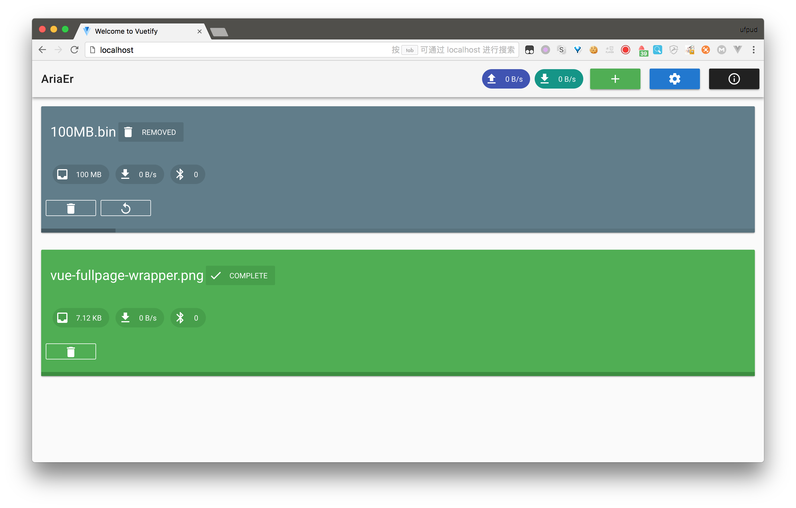

# ariaer-vuetify

> A simple Aria2 web client.



## Build Setup

``` bash
# install dependencies
npm install

# serve with hot reload at localhost:8080
npm run dev

# build for production with minification
npm run build
```

For detailed explanation on how things work, consult the [docs for vue-loader](http://vuejs.github.io/vue-loader).

## Todo

- 将过往的连接设置放入可选列表
- 背景改成深色
- 任务卡片改成一行多个
- IconTextChip加入提示的效果
- 加入Torrent下载的功能
- 加入任务搜索框
- 加入AriaEr的设置
- ~~希望在有生之年内能够完成~~